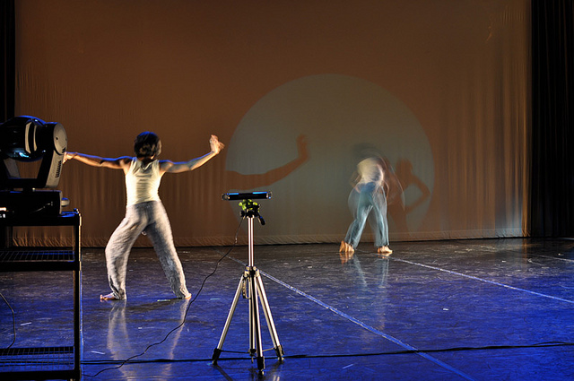
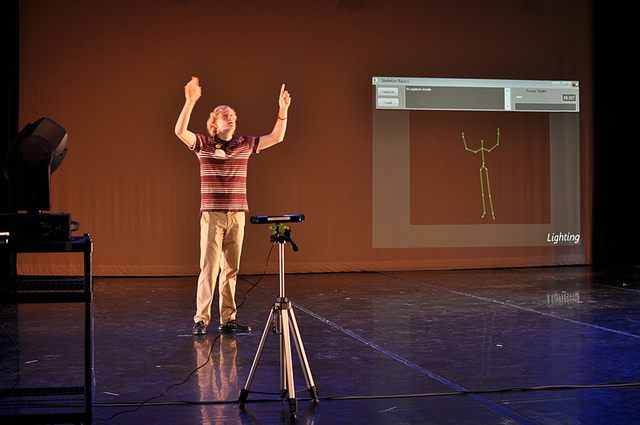

“Lights, Camera, Motion, Action: The Dance Application of Microsoft’s Kinect and Intelligent Stage Lighting”
This project aimed to integrate the Xbox Kinect with intelligent stage lighting, allowing users to control lights through gestures. Built on the Open Kinect project, this project interfaces with light fixtures through a DMX protocol, and features a GUI for settings and troubleshooing. This work was presented with a dance performance at UMBC's Undergraduate Research and Creative Achievement(URCAD) day.

